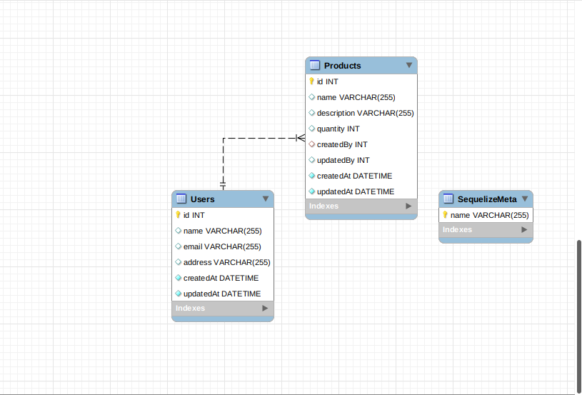

# ecommerce-nodejs
demo APIs for add products, update products and delete products

## Tech

It uses a number of open source projects to work properly:

- [node.js](https://nodejs.org/) - evented I/O for the backend
- [Express](https://expressjs.com/) - fast node.js network app framework
- [sequelize](https://sequelize.org/docs/v6/) - Sequelize is a promise-based Node.js ORM tool.
- [nodemon](https://www.npmjs.com/package/nodemon) - nodemon is a tool that helps develop Node.js based applications by automatically restarting the node application when file changes in the directory are detected.

## Installation

Install the dependencies and devDependencies.

```sh
cd ecommerce-nodejs
npm i
mv .env.example .env
```
Creating the db tables

```sh
npx sequelize-cli db:migrate
npx sequelize-cli db:seed:all
```

Start the server

```sh
npm run dev
```

Verify the deployment by navigating to your server address in
your preferred browser.

```sh
127.0.0.1:3000
```

## REST APIs

Postman collection

[Download file](./postman/eCommerce.postman_collection.json)

## DB design



